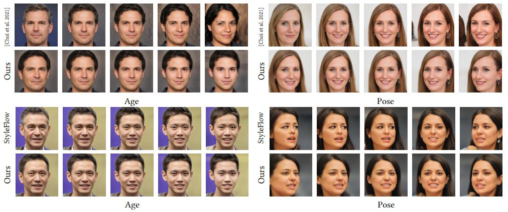
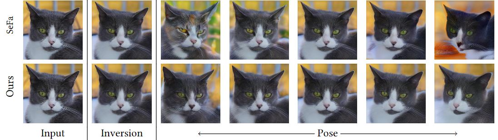

> **Self-Conditioned GANs for Image Editing**<br>
> Yunzhe Liu, Rinon Gal, Amit H. Bermano, Baoquan Chen, Daniel Cohen-Or <br>

>**Abstract**: <br>
> Generative Adversarial Networks (GANs) are susceptible to bias, learned from either the unbalanced data, or through mode collapse. The networks focus on the core of the data distribution, leaving the tails — or the edges of the distribution — behind. We argue that this bias is responsible not only for fairness concerns, but that it plays a key role in the collapse of latent-traversal editing methods when deviating away from the distribution’s core.
Building on this observation, we outline a method for mitigating generative bias through a self-conditioning process, where distances in the latent-space of a pre-trained generator are used to provide initial labels for the data. By fine-tuning the generator on a re-sampled distribution drawn from these self-labeled data, we force the generator to better contend with rare semantic attributes and enable more realistic generation of these properties.
We compare our models to a wide range of latent editing methods, and show that by alleviating the bias they achieve finer semantic control and better identity preservation through a wider range of transformations.

## tl;dr
By fine-tuning a pre-trained GAN and converting it to a self-conditioned model, we force it to better deal with minorities and decrease model biases.

Some comparisons to existing approaches are provided below:




### Pretrained Models
| Path | Description
| :--- | :----------
|[GAN Models](https://drive.google.com/drive/folders/10GB6M6PMmrmt_VAiHV_kfXcwIW1uKnzJ?usp=sharing)  | Our Fine-tuned GAN models.
|[e4e Models](https://drive.google.com/drive/folders/1oxSBeIroTATN5b0y2KvyoEyQxCcDElKl?usp=sharing)  | Our Fine-tuned e4e models.
|[Pose Eval Models](https://drive.google.com/drive/folders/1_m0FtY8Fh0Od6vUlF1YdIssB1AHphnnZ?usp=sharing)  | Put this folder under evals/ and then start evaluation.

## Training a self-conditioned model

### Data preparation:
We use the same data pre-processing steps as [rosinality's StyleGAN2-pytorch](https://github.com/rosinality/stylegan2-pytorch).

Place your image dataset in `DATASET_PATH` and run:

```bash
python prepare_data.py --out LMDB_PATH --n_worker N_WORKER --size SIZE1,SIZE2,SIZE3,... DATASET_PATH
```

### Training

To fine-tune a pre-trained model, run:

```bash
CUDA_VISIBLE_DEVICES=xxx python train_mmd.py --batch 4 --size 1024 --exp_name YOUR_EXP_NAME PATH_TO_LMDB_DATASET --ckpt PATH_TO_OFFICIAL_CKPT --channel_multiplier 2 --md_d 0.5 --md_g 0.5 --exp_setting YOUR_EXP_SETTING
```

Currently supported `exp_settings` are `glassesagepose`, `haircolorhairlonggender`, and `glassessmileage`.

--modes option represents number of modes in our mulitmodal stylegan model, in which 1 for base mode and 3 for each attribute.(So it's always 3n+1.) We by default set 7 for afhqcat and 10 for ffhq.

To use custom boundaries:

Our method uses distances as labels for whatever kinds of boundaries. So you need to compute distances to that boundary. It can be done easily with your boundary and e4e inverted latent codes for each image. You can obtain the latent codes with official e4e model.(scripts/inference.py)

### Inversion & Editing

We invert images using [e4e](https://github.com/omertov/encoder4editing) and [PTI](https://github.com/danielroich/PTI).

To finetune an e4e model for use with our model, please see `encoder4editing/train_sh.txt`

To run inversion with the finetuned model, run:
```bash
cd encoder4editing

CUDA_VISIBLE_DEVICES=xxx python scripts/inference.py \
--images_dir=PATH_TO_YOUR_IMAGES_DIR \
--save_dir=OUTPUT_PATH \
--ganpath=PATH_TO_YOUR_MULTIMODAL_STYLEGAN_CKPT \
PATH_TO_FINETUNED_E4E_CKPT \
--n_sample=25
```

To invert using PTI, first find a pivot latent code for your image by using the fine-tuned e4e model. Then run:
```bash
CUDA_VISIBLE_DEVICES=xxx python pti/conditional_pti.py \
--ckpt /path/to/our_finetuned_conditional_generator_ckpt.pt \
--output_dir /path/to/output \
--img_path /path/to/image.png \
--mode_file /path/to/modes.pt --mode_idx 0 \
--latent_file /path/to/latents.pt --latent_idx 0 \
--edit_mode_idx 0 --step_sizes 0.9 0.1 1.0
```

See `pti/conditional_pti.py` for details regarding all arguments.

Run the above 2 scripts sequentially and then you can get our editing results in /path/to/output.

Note that /path/to/modes.pt & /path/to/latents.pt in the second PTI script is obtained by running the first E4E inference script. They will be at OUTPUT_PATH/labels.pt and OUTPUT_PATH/latents.pt.


 ### Evaluation
 We provide evaluation codes for pose here:
 (First download Pose Eval Models above)
```bash
cd evals
# Please make sure pose is the third attribute. If not, you can modify prepare_test_id_full.py from line 28 to line 39.
CUDA_VISIBLE_DEVICES=xxx python prepare_test_id_full.py --exp_name YOUR_EXP_NAME --iter YOUR_CKPT_ITERATIONS --mmd --size 1024 --num_test 2000
python test_id.py --exp_name YOUR_EXP_NAME --num_test 20
# Note: You can use test_id.py for any other editing method, as long as you do preparations like prepare_test_id_full.py does for our method. 
```
